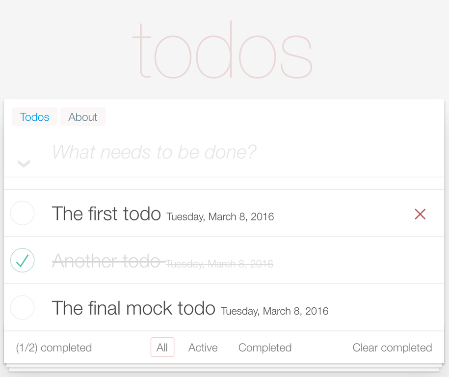
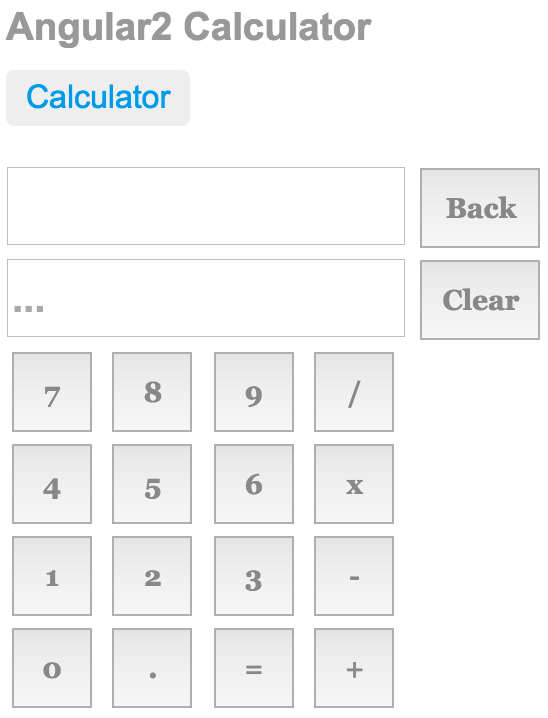

Angular Tutorials
=================

A set of tutorials followed when learnign Angular 2

* quick-start - [https://angular.io/docs/ts/latest/quickstart.html](https://angular.io/docs/ts/latest/quickstart.html)
* tour-of-heroes - [https://angular.io/docs/ts/latest/tutorial/](https://angular.io/docs/ts/latest/tutorial/)
* angular2-calc - an old demo angular1 project ported to angular2 - [https://github.com/jamesmorgan/angular-calc](https://github.com/jamesmorgan/angular-calc)
* angular2-todo -  basic todo application based on the TodoMVC style (See screen shot below)
* angular2-todo-forebase - (derived from the above TodoMVC app but using Firebase as the data store _WIP_)

#### angular2-todo


#### angular2-calc



Usage
=====

````bash
cd <tutorial>
npm install
npm start
````

This should launch a browser to [http://localhost:3000](http://localhost:3000)